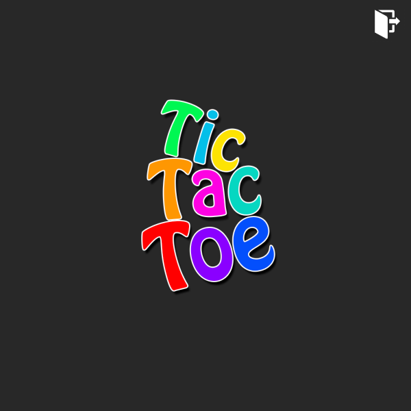
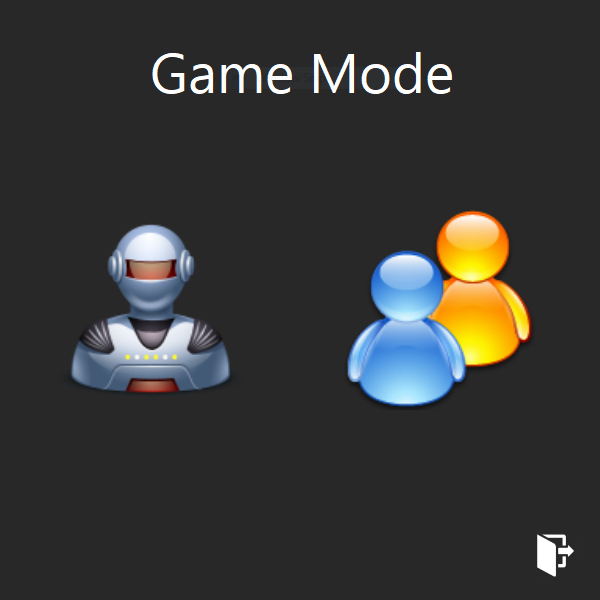
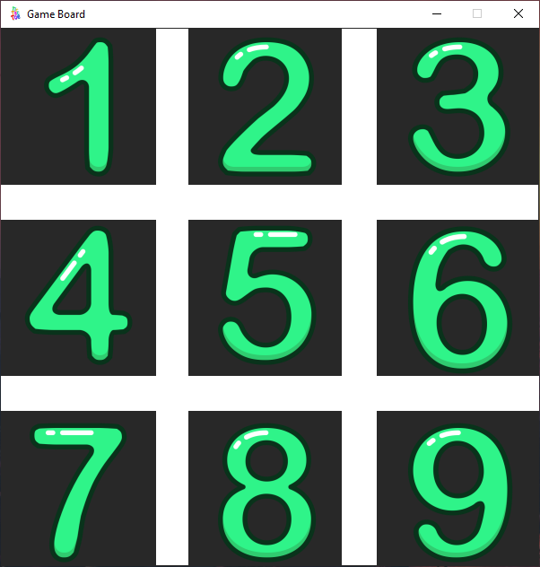
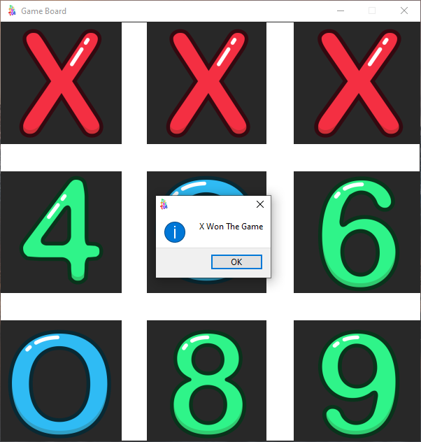

<h1 id="top">Tic Tac Toe Project - GUI</h1>

<h3>Table Of Contents</h3>
<a href="#sf">Special Features</a> 
<a href="#glry">Gallery</a> 
<a href="#docs">Documentation</a> 
<a href="#downloads">Downloads</a> 

<h3 id="sf">Special Features</h3>
<ol>
    <li>Frameless GUI Application.</li>
		<li>Excellent Appearence Of UI.</li>
		<li>User Can Either Play With Computer Or Even With Other User.</li>
		<li>Multiple Games Can Be Played At The Same Time</li>
</ol>

<h3 id="glry">Gallery</h3>

<h3 id="docs">Documentation</h3>
The File ("Documentation.txt") Includes The Documentation For The Following: 
<ul>
    <li>Exceptions</li>
    <li>Functions</li>
</ul>

<h3 id="downloads">Downloads</h3>
<a href="Snips.rar">Download Gallery</a> 
<a href="Documentation.rar">Download The Complete Documentation</a> 
<a href="shop_x86_x64.py">Download shop_x86_x64.py [main]</a> 
<a href="dependencies.py">Download dependencies.py [module]</a> 
<a href="shopping_project.rar">Download Complete Source Code [main, module, resources]</a> 

<a href="#top">Go To Table Of Contents</a>
